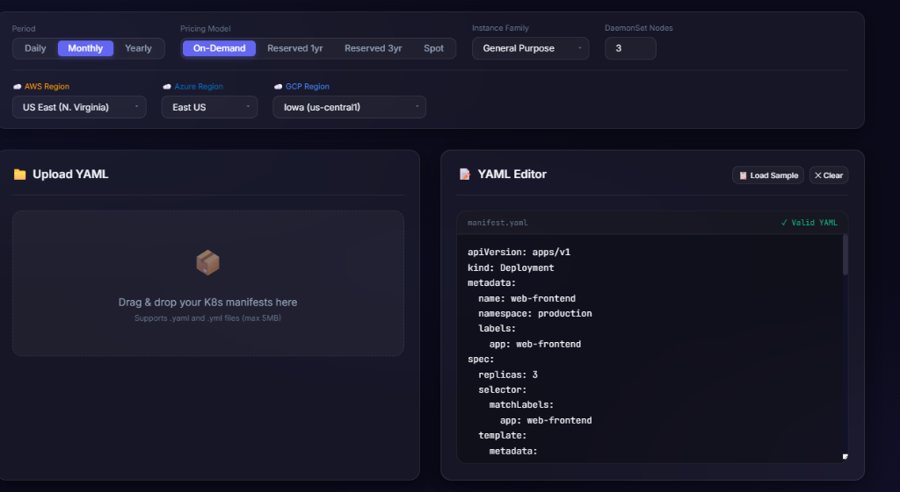
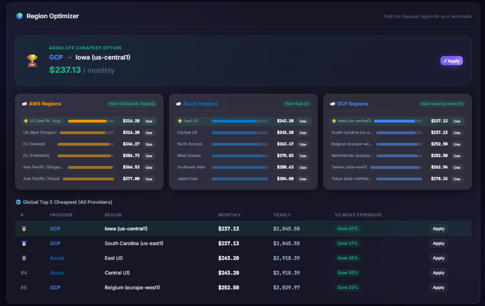
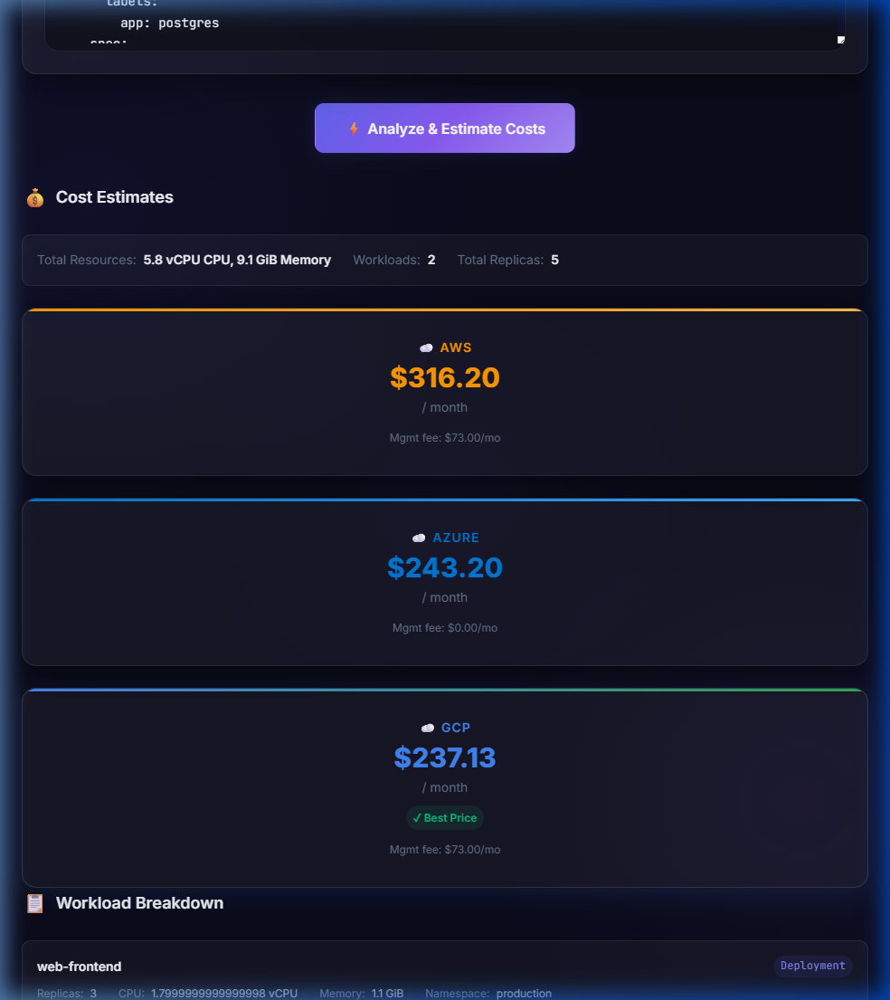
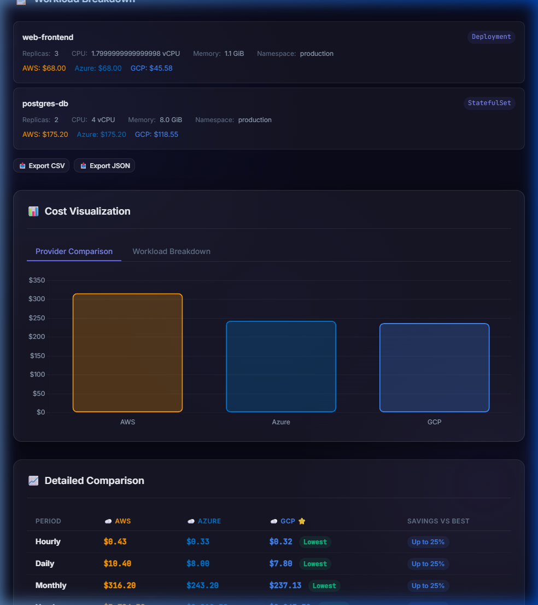

<div align="center">

# ☸️ K8s Cost Estimator

### Shift-Left Cloud Cost Analysis for Kubernetes

**From Dockerfile → K8s YAML → Multi-Cloud Cost Estimation — all in your browser.**

[](https://yourusername.github.io/k8scostestimator/)
[](LICENSE)
[](CONTRIBUTING.md)

[**🚀 Launch App**](https://yourusername.github.io/k8scostestimator/app.html) · [**📖 Docker to K8s Converter**](https://yourusername.github.io/k8scostestimator/guide.html) · [**☕ Support**](https://kreosus.com/baybarse/about)

</div>

---

## 🎯 What is K8s Cost Estimator?

An **open-source, client-side web tool** that helps DevOps/Platform engineers estimate Kubernetes workload costs **before deploying to production**. Upload your K8s YAML manifests (or generate them from a Dockerfile) and instantly compare pricing across **AWS EKS**, **Azure AKS**, and **GCP GKE**.

> **Shift-Left on Cloud Spending** — Know your costs at the YAML level, not after the bill arrives.

### ✨ Key Highlights

- 🐳 **Dockerfile → K8s YAML → Cost** — End-to-end pipeline in one tool
- ☁️ **3 Cloud Providers** — AWS EKS, Azure AKS, GCP GKE side-by-side comparison
- 🌍 **18 Regions** — Find the cheapest region globally with one click
- 💰 **4 Pricing Models** — On-Demand, Reserved 1yr/3yr, Spot/Preemptible
- 🔒 **100% Client-Side** — No backend, no sign-up, your data never leaves the browser

---

## 📸 Screenshots

<div align="center">

| Settings & YAML Editor | Region Optimizer |
|:---:|:---:|
|  |  |

| Cost Cards | Charts & Tables |
|:---:|:---:|
|  |  |

</div>

---

## 🚀 Features (20)

### 🐳 Docker → K8s Pipeline

| # | Feature | Description |
|---|---------|-------------|
| 1 | **Dockerfile Templates** | 6 production-ready templates: Node.js, Python, Java, .NET Core, Go, Ruby |
| 2 | **Dockerfile Auto-Detect** | Parses `EXPOSE` port and `FROM` base image to pre-fill deployment config |
| 3 | **K8s YAML Generator** | Generates Deployment + Service + HPA + Ingress manifests from Dockerfile |
| 4 | **Copy & Download YAML** | Copy to clipboard or download as `.yaml` — ready for `kubectl apply` |

### 💰 Cost Estimation Engine

| # | Feature | Description |
|---|---------|-------------|
| 5 | **Multi-Cloud Pricing** | AWS EKS, Azure AKS, GCP GKE side-by-side with cheapest highlighted |
| 6 | **4 Time Periods** | Hourly, daily, monthly, yearly breakdowns including management fees |
| 7 | **4 Pricing Models** | On-Demand, Reserved 1yr, Reserved 3yr, Spot/Preemptible |
| 8 | **3 Instance Families** | General Purpose, Compute Optimized, Memory Optimized |

### 🌍 Region & Optimization

| # | Feature | Description |
|---|---------|-------------|
| 9 | **Region Optimizer** | Scans 18 regions across all providers for the cheapest location |
| 10 | **Global Top 5** | Cheapest provider+region combos with savings % vs most expensive |
| 11 | **10 Best-Practice Checks** | Resource limits, health probes, QoS, image tags, replicas, PDB |
| 12 | **Health Score** | 0–10 score with severity-coded suggestions and cost impact |

### 📦 YAML & Data

| # | Feature | Description |
|---|---------|-------------|
| 13 | **6 K8s Resource Types** | Deployment, StatefulSet, DaemonSet, Job, CronJob, Pod |
| 14 | **Drag & Drop Upload** | Multi-file upload with built-in YAML editor and syntax validation |
| 15 | **Interactive Charts** | Chart.js bar charts + doughnut charts for cost visualization |
| 16 | **Detailed Tables** | Period comparison with "Lowest" badges and savings percentages |

### 🔧 Infrastructure

| # | Feature | Description |
|---|---------|-------------|
| 17 | **9 Currencies** | USD, EUR, GBP, TRY, JPY, CAD, AUD, INR, BRL — live exchange rates |
| 18 | **CSV & JSON Export** | Download results for CI/CD pipelines and reporting tools |
| 19 | **Auto-Updated Pricing** | Weekly GitHub Actions cron-job fetches fresh cloud prices |
| 20 | **100% Client-Side** | No backend, no sign-up, no data leaves your browser |

---

## 🛠️ Tech Stack

| Layer | Technology |
|-------|-----------|
| **Frontend** | Vanilla JS (ES Modules), HTML5, CSS3 |
| **Build** | Vite 6 |
| **Charts** | Chart.js |
| **YAML Parsing** | js-yaml |
| **Currency** | Frankfurter API |
| **CI/CD** | GitHub Actions |
| **Hosting** | GitHub Pages |
| **Pricing Data** | AWS Bulk API, Azure Retail API, GCP Billing API |

---

## 📁 Project Structure

```
k8scostestimator/
├── index.html                  # Landing page (20 features, SEO, screenshots)
├── app.html                    # Cost estimator application
├── guide.html                  # Docker to K8s Converter + YAML generator
├── vite.config.js              # Vite multi-page config
├── package.json
│
├── src/
│   ├── main.js                 # App entry point & state management
│   ├── core/
│   │   ├── cost-calculator.js  # Pricing engine (3 providers × 6 regions)
│   │   ├── currency.js         # Currency conversion with Frankfurter API
│   │   ├── optimizer.js        # 10 K8s best-practice checks
│   │   └── yaml-parser.js      # YAML parsing for 6 resource types
│   ├── components/
│   │   ├── chart.js            # Chart.js visualizations
│   │   ├── cost-comparison.js  # Provider comparison cards
│   │   ├── file-upload.js      # Drag & drop file upload
│   │   ├── optimization-panel.js # Health score & suggestions
│   │   ├── region-optimizer.js # Region comparison & top 5
│   │   ├── results-panel.js    # Cost results display
│   │   ├── settings-panel.js   # Settings toolbar
│   │   └── yaml-editor.js      # Built-in YAML editor
│   ├── data/
│   │   ├── aws-pricing.js      # AWS EKS pricing data
│   │   ├── azure-pricing.js    # Azure AKS pricing data
│   │   ├── gcp-pricing.js      # GCP GKE pricing data
│   │   ├── regions.js          # Region definitions
│   │   └── pricing/metadata.json
│   ├── styles/
│   │   ├── index.css           # Main stylesheet
│   │   ├── components.css      # Component styles
│   │   └── animations.css      # Animations & transitions
│   └── utils/
│       ├── constants.js        # App constants
│       └── formatters.js       # Number & currency formatters
│
├── scripts/
│   ├── fetch-aws-pricing.js    # AWS Bulk Pricing API fetcher
│   ├── fetch-azure-pricing.js  # Azure Retail Prices API fetcher
│   ├── fetch-gcp-pricing.js    # GCP Cloud Billing API fetcher
│   └── update-all-pricing.js   # Orchestrates all pricing updates
│
├── public/
│   ├── favicon.svg
│   └── screenshots/            # App screenshots for landing page
│
└── .github/workflows/
    ├── deploy.yml              # GitHub Pages deployment
    └── update-pricing.yml      # Weekly pricing data update (cron)
```

---

## ⚡ Quick Start

### Prerequisites
- Node.js 18+ and npm

### Development

```bash
# Clone the repository
git clone https://github.com/yourusername/k8scostestimator.git
cd k8scostestimator

# Install dependencies
npm install

# Start dev server
npm run dev
```

The app will be available at `http://localhost:3000/k8scostestimator/`

### Production Build

```bash
npm run build    # Output in dist/
npm run preview  # Preview production build
```

---

## 📊 Pricing Data Sources

| Provider | API | Auth Required | Update Frequency |
|----------|-----|:---:|:---:|
| **AWS** | [Bulk Pricing API](https://pricing.us-east-1.amazonaws.com) | ❌ None | Weekly (Monday 06:00 UTC) |
| **Azure** | [Retail Prices API](https://prices.azure.com) | ❌ None | Weekly (Monday 06:00 UTC) |
| **GCP** | [Cloud Billing API](https://cloudbilling.googleapis.com) | ❌ None | Weekly (Monday 06:00 UTC) |

Pricing is automatically fetched via GitHub Actions cron-job every Monday at 06:00 UTC.

### Manual Pricing Update

```bash
node scripts/update-all-pricing.js
```

---

## 🌐 Deployment (GitHub Pages)

1. Push to `main` branch
2. Go to **Settings → Pages → Source** → Select **GitHub Actions**
3. The `deploy.yml` workflow handles build and deployment automatically

### GitHub Actions Workflows

| Workflow | Trigger | Purpose |
|----------|---------|---------|
| `deploy.yml` | Push to `main` | Build & deploy to GitHub Pages |
| `update-pricing.yml` | Cron (Monday 06:00 UTC) | Fetch fresh pricing from cloud APIs |

---

## 🗺️ Supported Regions

| Provider | Regions |
|----------|---------|
| **AWS** | US East (N. Virginia), US West (Oregon), EU (Ireland), EU (Frankfurt), Asia Pacific (Singapore), Asia Pacific (Tokyo) |
| **Azure** | East US, Central US, North Europe, West Europe, Southeast Asia, Japan East |
| **GCP** | Iowa (us-central1), South Carolina (us-east1), Belgium (europe-west1), Netherlands (europe-west4), Taiwan (asia-east1), Tokyo (asia-northeast1) |

---

## 🤝 Contributing

Contributions are welcome! Here's how:

1. **Fork** the repository
2. **Create** a feature branch (`git checkout -b feature/amazing-feature`)
3. **Commit** your changes (`git commit -m 'Add amazing feature'`)
4. **Push** to the branch (`git push origin feature/amazing-feature`)
5. **Open** a Pull Request

### Development Guidelines

- Use ES Modules (`import`/`export`)
- Follow existing code patterns and component structure
- Test with `npm run build` before submitting PR
- Keep pricing data files auto-generated (don't edit manually)

---

## 📝 License

This project is licensed under the **MIT License** — see the [LICENSE](LICENSE) file for details.

---

## ☕ Support

If this tool saved you time or money, consider supporting development:

<a href="https://kreosus.com/baybarse/about" target="_blank">
  
</a>

---

<div align="center">
  <sub>Built with ❤️ for the Kubernetes community</sub>
</div>

